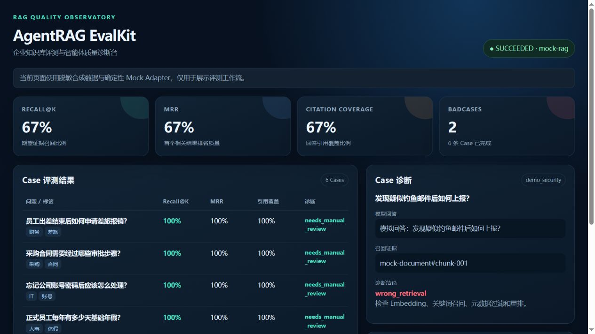
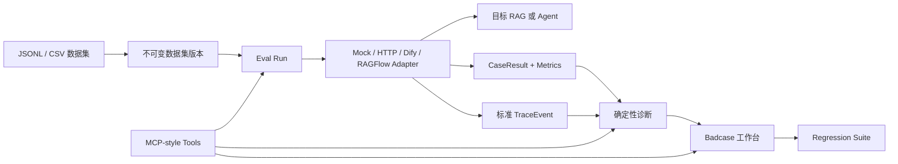

# AgentRAG EvalKit

面向企业知识库与 AI Agent 的轻量级评测、Trace 诊断和 Badcase 回归工具。项目以 Python 实现，重点展示如何把“准备评测集、调用目标 RAG、计算指标、分析失败原因、沉淀回归集”串成一条可复现的工程链路。

> 当前仓库是作品集 Demo：默认使用内存存储、Mock Adapter 和脱敏合成数据，不包含生产数据，也不宣称生产并发能力。



Dashboard 将评测指标、逐 Case 结果、检索证据和 Badcase 诊断集中到一个页面。启动服务后访问 <http://127.0.0.1:8000/dashboard>；页面中的数据来自实际评测服务调用，不是静态截图，当前演示数据范围会在页面顶部明确标注。

## 核心能力

| 模块 | 已实现能力 |
| --- | --- |
| 数据集 | JSONL/CSV 导入、Schema 校验、版本号与校验和 |
| RAG 评测 | Recall@K、MRR、Citation Coverage、Empty Retrieval Rate |
| 回答校验 | 关键词、正则、基础 JSON Schema、引用存在性与有效性、人工评分 |
| Trace | 标准 TraceEvent、脱敏、LangGraph Callback 采集、Langfuse 可选导出 |
| 诊断 | 检索候选、相似度、重排结果、过滤原因和确定性失败归因 |
| Badcase | 严重级别、负责人、状态流转、处理记录、筛选与统计 |
| 回归测试 | 从 Badcase 建立回归集，对比基线与候选运行 |
| 集成 | 通用 HTTP Adapter、Dify、RAGFlow、MCP 风格工具服务 |
| 服务化 | FastAPI、OpenAPI、CSV 导出、Docker Compose、健康检查 |

## 架构概览



更完整的模块、数据流和部署边界见 [架构文档](docs/architecture.md)。

## Quickstart

### 1. 零依赖运行核心 Demo

仅需 Python 3.11+，无需 API Key、数据库或外部模型：

```bash
python main.py
```

该命令会创建合成数据集和评测配置，通过 Mock Adapter 执行两条样本，并输出运行摘要和 CSV 结果。

### 2. 运行测试

```bash
python -m unittest discover -s tests -v
```

测试使用 Fake HTTP 响应验证 Dify/RAGFlow 字段映射，不会访问真实外部服务。

### 3. 启动 FastAPI

```bash
pip install -e .
uvicorn app.main:app --reload
```

启动后访问：

- 可视化 Dashboard：<http://127.0.0.1:8000/dashboard>
- OpenAPI：<http://127.0.0.1:8000/docs>
- 健康检查：<http://127.0.0.1:8000/health>
- 就绪检查：<http://127.0.0.1:8000/ready>

最小 API 流程为：创建 Dataset → 导入 DatasetVersion → 创建 Config → 创建并执行 EvalRun → 查询 Result/Trace/Diagnosis → 创建 Badcase。

### 4. Docker 启动

```bash
docker compose up --build -d
docker compose ps
```

Compose 会启动 EvalKit API（8000）和合成 Mock RAG（8001），两个服务均带健康检查和资源限制；不会启动 PostgreSQL、Redis、消息队列或真实模型。资源要求、安全限制和故障排查见 [Docker Compose 部署说明](docs/deployment.md)。

### 5. 启动 MCP 风格 stdio 服务

```bash
python -m app.mcp_main
```

当前实现为依赖较少的 JSON-RPC/stdio 演示服务，提供 `evaluate_rag`、`explain_retrieval` 和 `get_badcase_summary`，并包含参数校验、超时、Token 鉴权和审计能力；它不是官方 MCP SDK Server 的替代品。

### 6. 运行独立 Mock RAG 的 HTTP 演示

```bash
# Terminal 1
uvicorn app.mock_rag_service:app --host 127.0.0.1 --port 8001

# Terminal 2
python -m scripts.demo_http_eval
```

该流程会加载 4 条合成评测样本，通过通用 HTTP Adapter 调用独立模拟服务并输出逐条结果。完整说明见 [示例数据与 HTTP 演示](docs/demo.md)。

## 对接真实系统

- 通用 HTTP 服务：实现 [HTTP Adapter 契约](docs/http-adapter-contract.md)。
- Dify Chat App：使用 [Dify Adapter](docs/dify-adapter.md)，当前支持 blocking 响应及 `retriever_resources` 映射。
- RAGFlow Chat：使用 [RAGFlow Adapter](docs/ragflow-adapter.md)，当前支持 OpenAI 兼容的非流式接口及 `reference.chunks` 映射。
- LangGraph：使用 [Callback Adapter](docs/langgraph-callback-adapter.md)采集节点事件。
- Langfuse：使用 [Langfuse Exporter](docs/langfuse-integration.md)导出运行、模型、Token 与成本信息。

真实接入前请使用环境变量或密钥管理系统注入凭据，不要将 Token 写入数据集、Trace 或代码仓库。

## 能力边界

### 当前已实现

- 单进程同步评测闭环和内存数据模型。
- 确定性的检索指标、回答规则校验、失败诊断及回归比较。
- FastAPI、MCP 风格工具接口和多种 Adapter 示例。
- 只读可视化 Dashboard，展示合成演示运行的指标、Case 结果和 Badcase 诊断。
- Trace 脱敏、基础鉴权、超时重试和服务审计。

### 当前未实现

- PostgreSQL 等持久化存储、租户隔离和完整 RBAC。
- 异步任务队列、分布式 Worker、断点恢复及大规模并发调度。
- 可写 Web 管理后台、实时评测进度页面和人工标注界面。
- 基于语义模型的裁判指标、统计显著性分析和生产告警。
- 官方 MCP SDK 的完整协议生命周期，以及真实 Dify/RAGFlow 环境联调证明。

因此，仓库中的测试结果用于证明流程和接口正确性，不能等同于真实知识库的效果或生产 SLA。

## 项目结构

```text
app/
  api.py                 FastAPI 路由
  dashboard.py           Dashboard 演示数据与只读快照接口
  static/dashboard.html  无构建步骤的可视化页面
  service.py             评测、诊断、Badcase 与回归业务逻辑
  domain.py              核心领域模型
  repository.py          内存存储实现
  metrics.py             检索与引用指标
  trace.py               Trace 标准化与脱敏
  quality.py             确定性回答校验
  mcp_server.py          MCP 风格工具服务
  *_adapter.py           LangGraph、HTTP、Dify、RAGFlow 适配器
docs/                    架构、集成与功能说明
examples/                外部系统脱敏响应样例
sample_data/             合成评测集
scripts/                 可复现基准脚本
tests/                   单元与端到端契约测试
```

## 文档索引

- [系统架构](docs/architecture.md)
- [示例数据与 HTTP 演示](docs/demo.md)
- [Docker Compose 部署](docs/deployment.md)
- [性能与成本基线](docs/performance-baseline.md)
- [常见问题](docs/faq.md)
- [验证记录](docs/validation.md)
- [集成映射](docs/integrations.md)
- [Badcase 工作台](docs/badcase-workbench.md)
- [回归测试](docs/regression-suite.md)
- [回答质量校验](docs/answer-quality-validation.md)
- [MCP 基础设施](docs/mcp-infrastructure.md)
- [Dify Adapter](docs/dify-adapter.md)
- [RAGFlow Adapter](docs/ragflow-adapter.md)

## 安全说明

不要向仓库提交真实公司文档、个人信息、API Key、Cookie 或生产 Trace。示例数据必须脱敏；连接高敏感业务系统时，还需补充租户隔离、细粒度权限、数据保留策略和合规审查。

## 开发与贡献

本地贡献规范见 [CONTRIBUTING.md](CONTRIBUTING.md)，版本记录见 [CHANGELOG.md](CHANGELOG.md)。CI 会在 Python 3.11/3.12 上执行编译、Ruff、全量测试和独立 Adapter 契约测试，并验证 Compose 和 Docker 镜像构建。

提交问题请使用结构化 Issue Forms，代码变更请填写 PR 模板。安全漏洞不要公开提交 Issue，报告方式见 [SECURITY.md](SECURITY.md)；所有参与者需遵守 [CODE_OF_CONDUCT.md](CODE_OF_CONDUCT.md)。

## Benchmark

```bash
python -m scripts.benchmark --cases 100 --rounds 20 --concurrency 4 --warmup 2
```

输出包含运行环境、并发、P50/P95/P99、吞吐和实际成本口径。完整方法与边界见 [性能与成本基线](docs/performance-baseline.md)；结果仅用于本地开发回归，不是生产容量声明。

## License

[MIT](LICENSE)
