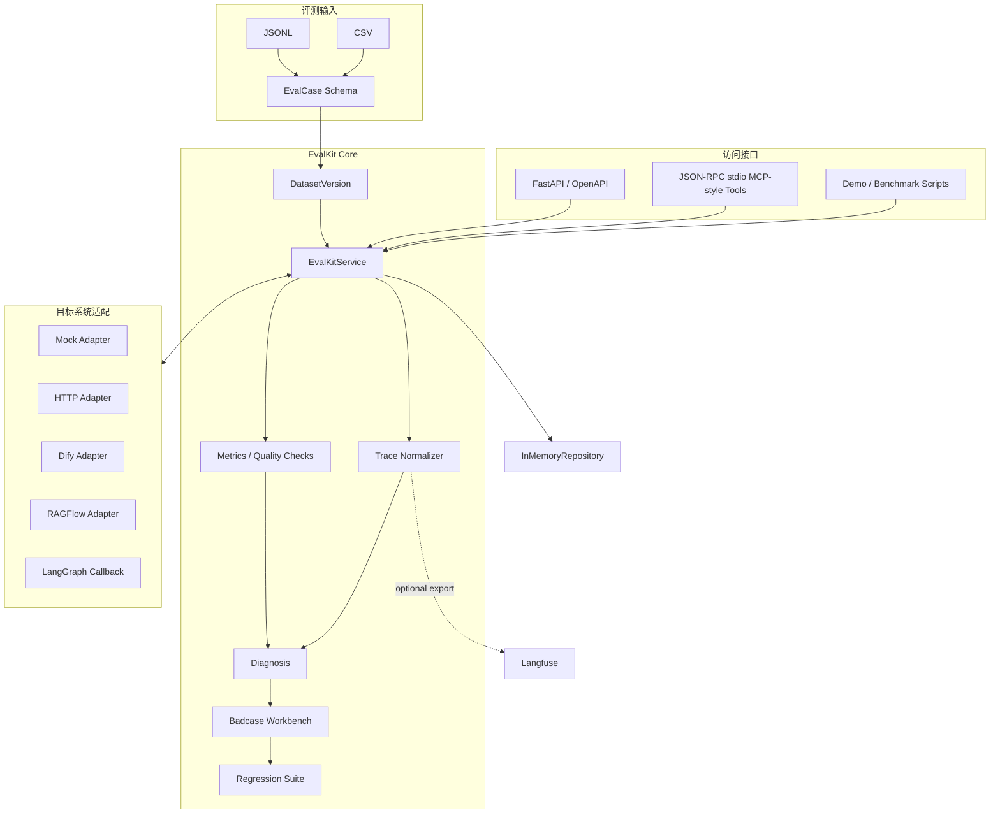
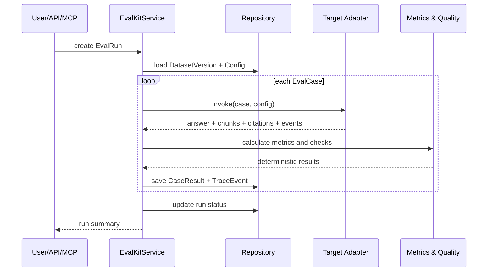
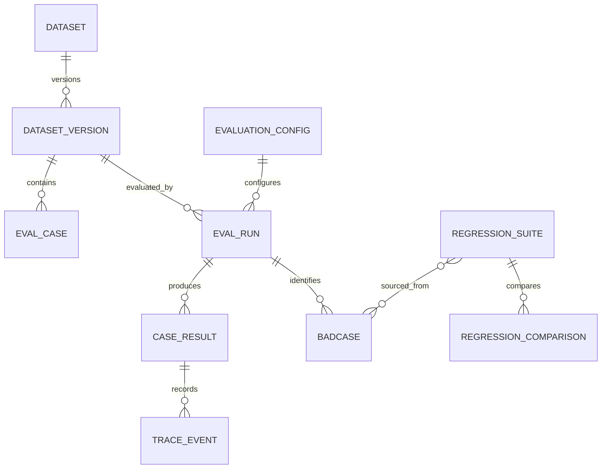
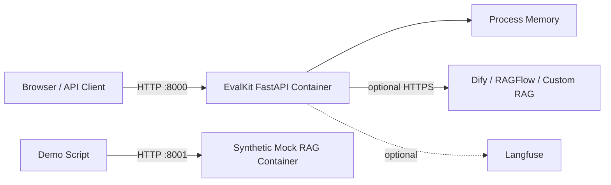

# AgentRAG EvalKit 系统架构

## 1. 架构定位

AgentRAG EvalKit 位于评测数据与目标 RAG/Agent 服务之间。它不负责训练模型或承载企业知识库，而是负责统一输入、调用目标系统、计算确定性指标、记录 Trace、诊断失败并把典型问题沉淀为回归集。

当前版本采用单进程同步执行和内存存储，适合本地演示、接口验证和小规模离线评测。

## 2. 总体架构

## 3. 后端分层

| 层次 | 主要模块 | 职责 |
| --- | --- | --- |
| 接口层 | `app/api.py`、`app/mcp_server.py` | HTTP/JSON-RPC 参数接收、错误映射、返回结构 |
| 应用层 | `app/service.py` | 评测运行、诊断、Badcase、人工评分和回归编排 |
| 领域层 | `app/domain.py` | Dataset、EvalRun、TraceEvent、Badcase 等模型及状态约束 |
| 算法层 | `app/metrics.py`、`app/quality.py`、`app/trace.py` | 指标计算、规则校验、Trace 标准化与脱敏 |
| 集成层 | `app/*_adapter.py`、`app/langfuse_exporter.py` | 对接目标 RAG、Agent 和可观测平台 |
| 存储层 | `app/repository.py` | 当前提供进程内存储，负责实体保存与查询 |

## 4. 核心评测流程

失败不会被隐藏为正常结果：Adapter 异常会形成失败 CaseResult 和 Error Trace；非法运行状态转换会被领域模型拒绝。

## 5. 数据模型关系

DatasetVersion 使用校验和描述不可变输入，回归比较同时保存基线和候选的数据集版本，避免只比较运行 ID 而丢失数据上下文。

## 6. Adapter 边界

所有目标系统最终需要映射为统一结果：

- `answer`：最终回答文本。
- `retrieved_chunks`：带 ID、内容、分数、排序和元数据的候选切片。
- `citations`：回答引用的证据标识。
- `events`：Retrieval、Rerank、LLM、Tool、Error、Final 等事件。
- `usage/cost`：目标系统能够提供时记录，不凭空估算。

Dify 与 RAGFlow Adapter 当前都使用非流式接口，以便保证一次评测调用得到完整且确定的响应结构；真实网络联调仍需由使用者在自己的服务环境完成。

## 7. 接口与工具

FastAPI 暴露数据集、配置、运行、结果、Trace、诊断、Badcase、回归比较和审计查询。OpenAPI 文档由 `/docs` 自动生成。

MCP 风格服务提供：

| 工具 | 作用 |
| --- | --- |
| `evaluate_rag` | 创建、执行或查询评测运行 |
| `explain_retrieval` | 展示候选、分数、过滤原因和确定性诊断 |
| `get_badcase_summary` | 按版本、标签、严重级别等条件聚合 Badcase |

当前为 JSON-RPC/stdio 演示实现，具备 allowlist、参数校验、超时、Token 校验和审计，但不覆盖官方 MCP SDK 的完整协议生命周期。

## 8. 部署结构

Docker Compose 启动 EvalKit API 与 Synthetic Mock RAG 两个容器。容器重启后 EvalKit 内存数据会丢失，这一行为属于明确边界，而不是持久化保证。

## 9. 安全与可观测性

已实现：

- Trace 常见敏感字段脱敏。
- MCP 工具 allowlist、可选 Token 鉴权、参数校验、超时与审计。
- Adapter 超时、有限重试和结构校验。
- 健康检查、就绪检查及 Langfuse 可选导出。

生产化仍需补充：统一身份认证、租户级 RBAC、密钥托管、审计持久化、数据保留/删除策略、网络隔离、指标告警和分布式链路追踪。

## 10. 已知风险与演进方向

| 风险 | 当前影响 | 建议演进 |
| --- | --- | --- |
| 内存存储 | 重启丢失、无法多副本共享 | 引入 PostgreSQL 和迁移脚本 |
| 同步执行 | 长评测阻塞请求线程 | 引入队列、Worker、进度与取消机制 |
| 规则型答案校验 | 无法覆盖所有语义等价回答 | 增加可配置 Judge，并保留人工复核 |
| 外部 Adapter 只做契约测试 | 真实版本差异尚未验证 | 增加沙箱集成测试和兼容矩阵 |
| 无管理前端 | Badcase 人工处理不直观 | 增加只读看板与审核工作台 |
